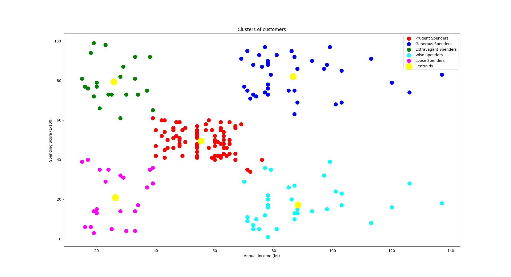

# K-Means Clustering
K-Means Clustering with FastAPI and Streamlit App

## Table of Contents
- [Description](#description)
- [Requirements](#requirements)
- [Getting Started](#getting-started)
  - [1. Train and Save the Model](#1-train-and-save-the-model)
  - [2. Deploy FastAPI](#2-deploy-fastapi)
  - [3. Run Streamlit](#3-run-streamlit)
- [Usage](#usage)
- [Endpoints](#endpoints)
- [Example Input and Output](#example-input-and-output)
- [File Structure](#file-structure)
- [License](#license)

## Description

This project demonstrates clustering data into groups using the K-Means algorithm. It includes an API for clustering and a Streamlit app where users can input data to find the appropriate cluster. The dataset includes the following features:

- Annual Income (k$)
- Spending Score (1-100)

The API is deployed using FastAPI, while Streamlit provides a user-friendly interface for submitting data and retrieving cluster information.

## Requirements
To set up and run this project, you’ll need the following Python packages:

- `fastapi`
- `uvicorn`
- `scikit-learn`
- `pandas`
- `joblib`
- `numpy`
- `streamlit`

You can install these dependencies by running:
```bash
pip install -r requirements.txt
```

## Getting Started
Follow these steps to set up and run the project.

1. Train and Save Model

  Train the K-Means model using Scikit-Learn and save to file for deployment:
  ```bash
  python k_means_model.py
  ```
  This will create the `model.pkl` file in the `model/` directory.

2. Deploy FastAPI
The FastAPI application (`api.py`) loads the saved model and provides an endpoint for predictions. Run it using `uvicorn`:
  ```bash
  uvicorn api:app --reload
  ```
This will start the FastAPI server at `http://127.0.0.1:8000`

3. Run Streamlit
The Streamlit app allows users to input values and retrieve predictions from the FastAPI server. To start Streamlit, run:
  ```bash
  streamlit run app.py
  ``` 
The Streamlit app will open in a browser window at `http://localhost:8501`.

## Usage

FastAPI Endpoints


- POST /predict
  - Description: Returns the predicted cluster (`Prudent Spender`,`Generous Spender`, `Extravagant Spender`, `Wise Spender`, `Loose Spender`) for the input data.
  - Input JSON:
  ```bash
  {
    "annual_income": 18,
    "spending_score": 72
  }
  ```
  - Output JSON:
  ```bash
  {
    "cluster": "Extravagant Spender"
  }
  ```
  
### Streamlit Application

The Streamlit app provides an interface for users to input feature values and get predictions. When the Predict button is clicked, the app sends the data to the FastAPI server and displays the grouping.

## Example Input and Output
Example Input:

Annual Income = 18 
Spending Score = 72  

Example Output:

Prediction: `Extravagant Spender`


## File Structure
The project directory is structured as follows:

```
📦 logistic_regression_classifier
├─ data
│  └─ data_clustering.csv
├─ model
│  └─ model.pkl
├─ src
├─ .gitignore
├─ app.py
├─ api.py
├─ k_means_model.py
├─ README.md
└─ requirements.txt
```
## License
This project is licensed under [](https://opensource.org/licenses/MIT)